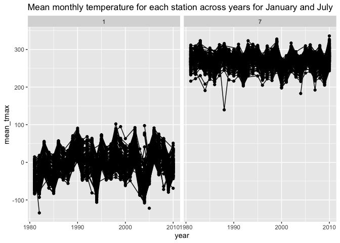
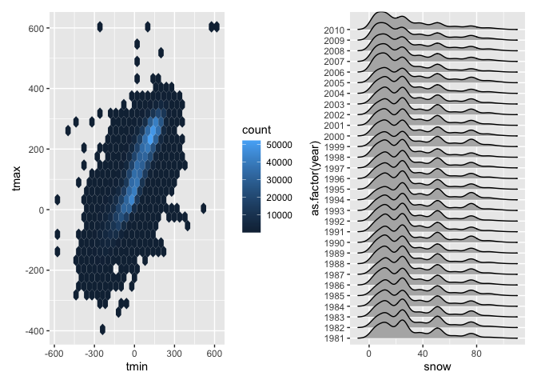
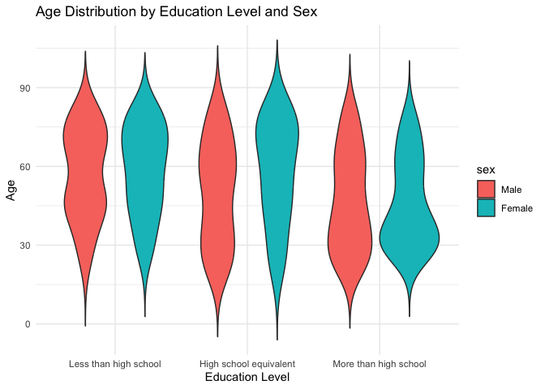
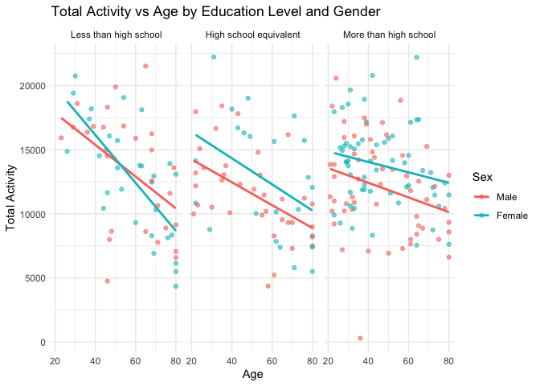
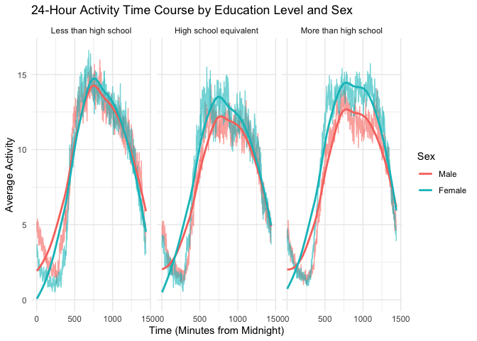
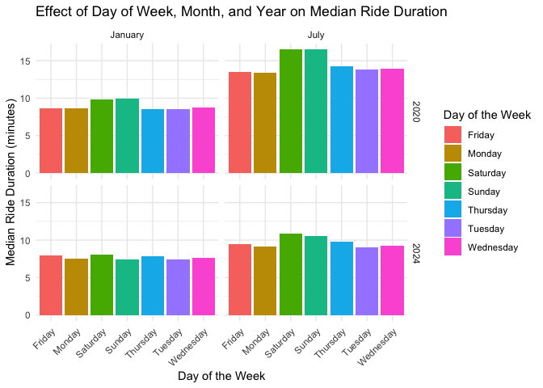
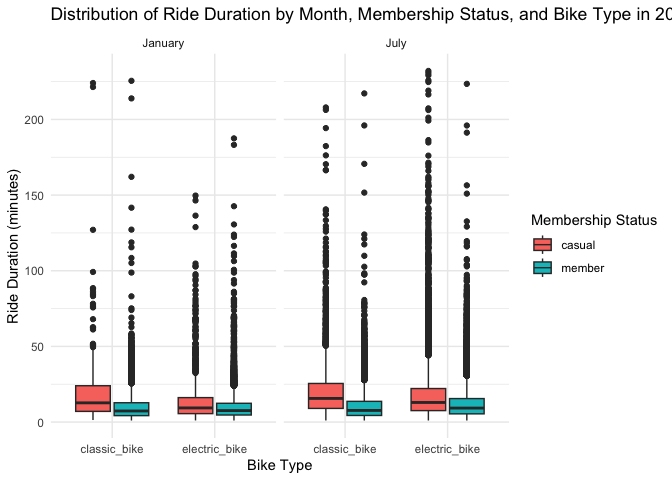

hw3
================
Zitao Zhang
2024-10-14

# Problem 1

``` r
library(p8105.datasets)
data("ny_noaa")
```

This dataset contains 2595176 rows and 7 columns. It includes 7 key
variables:

id: Weather station identifier (e.g., “US1NYAB0001”).  
date: The date on which the observation was made.  
prcp: Daily precipitation recorded in tenths of millimeters.  
snow: Daily snowfall in millimeters.  
snwd: Snow depth in millimeters.  
tmax: Maximum temperature recorded in tenths of degrees Celsius.  
tmin: Minimum temperature recorded in tenths of degrees Celsius.

``` r
ny_noaa %>% 
  count(snow) %>%
  arrange(desc(n))
```

    ## # A tibble: 282 × 2
    ##     snow       n
    ##    <int>   <int>
    ##  1     0 2008508
    ##  2    NA  381221
    ##  3    25   31022
    ##  4    13   23095
    ##  5    51   18274
    ##  6    76   10173
    ##  7     8    9962
    ##  8     5    9748
    ##  9    38    9197
    ## 10     3    8790
    ## # ℹ 272 more rows

``` r
ny_noaa = 
  ny_noaa %>% 
  separate(date, into = c("year", "month", "day"), convert = TRUE) %>% 
  mutate(
    tmax = as.numeric(tmax),
    tmin = as.numeric(tmin))
```

We clean the dataset by creating separate variables for year, month, and
day from the date column, and we convert `tmax` and `tmin` to numeric
values.

Upon reviewing the snowfall data, we find that the most commonly
observed value for snowfall is 0, which is expected since there are many
days throughout the year when no snow falls in New York. The second most
frequent value is `NA`, representing missing data. Other common values
include 13, 25, and 51, which suggests that snowfall measurements are
initially recorded in fractions of an inch and later converted to
millimeters.

``` r
ny_noaa %>% 
  group_by(id, year, month) %>% 
  filter(month %in% c(1, 7)) %>% 
  summarize(mean_tmax = mean(tmax, na.rm = TRUE, color = id)) %>% 
  ggplot(aes(x = year, y = mean_tmax, group = id)) + geom_point() + geom_path() +
  facet_grid(~month) +
  labs(title = "Mean monthly temperature for each station across years for January and July")
```

<!-- -->

Above is a two-panel plot showing the average maximum temperature for
January and July across all stations and years. As expected, the average
temperature in January is significantly lower than in July for all
stations and years. The stations exhibit consistent trends, with
temperature peaks and valleys aligned across different stations within
the same month and year. For example, when one station records a high
monthly average temperature in a particular year, most other stations
display similar patterns. There is an unusual outlier in July of either
1987 or 1988, where one station recorded an abnormally low temperature,
along with a few other, less extreme outliers.

``` r
hex = 
  ny_noaa %>% 
  ggplot(aes(x = tmin, y = tmax)) + 
  geom_hex()

ridge = 
  ny_noaa %>% 
  filter(snow < 100, snow > 0) %>%
  ggplot(aes(x = snow, y = as.factor(year))) + 
  geom_density_ridges()

hex + ridge
```

    ## Picking joint bandwidth of 3.76

<!-- -->

Above is a two-panel plot featuring (i) a hex plot of `tmax` vs `tmin`
for the entire dataset, and (ii) a ridge plot showing the distribution
of snowfall values (in mm) greater than 0 and less than 100, separated
by year.

In the hex plot, we observe that despite some variability, most data
points are tightly clustered around the center. Interestingly, there are
rare instances where `tmax` is recorded as being lower than `tmin`,
which raises potential concerns about the accuracy or quality of the
data collection.

The ridge plot shows a multimodal distribution of snowfall within a
given year. Most stations report between 0 and 35 mm of snowfall
annually. There are additional groups of stations reporting around 45 mm
and close to 80 mm of snowfall. This multimodal pattern likely results
from the conversion of snowfall measurements from fractions of an inch
to the metric system, as also indicated in the table of common snowfall
values.

# Problem 2

### Process data

``` r
# Load the data
nhanes_covar <- read_csv("data/nhanes_covar.csv", skip = 4) %>%
  clean_names()

nhanes_accel <- read_csv("data/nhanes_accel.csv") %>%
  clean_names() 

# Filter out participants under 21 years old
nhanes_covar_clean <- nhanes_covar %>%
  filter(age >= 21)

# Exclude rows with missing demographic data (education and sex)
nhanes_covar_clean <- nhanes_covar_clean %>%
  drop_na(education, sex)

# Encode variables as factors
nhanes_covar_clean <- nhanes_covar_clean %>%
  mutate(
    sex = factor(sex, levels = c(1, 2), labels = c("Male", "Female")),
    education = factor(education, levels = c(1, 2, 3),
                       labels = c("Less than high school", "High school equivalent", 
                                  "More than high school"))
  )

# Merge the cleaned demographic data with the accelerometer data
nhanes_merged <- nhanes_covar_clean %>%
  inner_join(nhanes_accel, by = "seqn")

# View merged dataset
head(nhanes_merged)
```

    ## # A tibble: 6 × 1,445
    ##    seqn sex      age   bmi education  min1  min2  min3  min4   min5   min6  min7
    ##   <dbl> <fct>  <dbl> <dbl> <fct>     <dbl> <dbl> <dbl> <dbl>  <dbl>  <dbl> <dbl>
    ## 1 62161 Male      22  23.3 High sch… 1.11  3.12  1.47  0.938 1.60   0.145  2.10 
    ## 2 62164 Female    44  23.2 More tha… 1.92  1.67  2.38  0.935 2.59   5.22   2.39 
    ## 3 62169 Male      21  20.1 High sch… 5.85  5.18  4.76  6.48  6.85   7.24   6.12 
    ## 4 62174 Male      80  33.9 More tha… 5.42  3.48  3.72  3.81  6.85   4.45   0.561
    ## 5 62177 Male      51  20.1 High sch… 6.14  8.06  9.99  6.60  4.57   2.78   7.10 
    ## 6 62178 Male      80  28.5 High sch… 0.167 0.429 0.131 1.20  0.0796 0.0487 0.106
    ## # ℹ 1,433 more variables: min8 <dbl>, min9 <dbl>, min10 <dbl>, min11 <dbl>,
    ## #   min12 <dbl>, min13 <dbl>, min14 <dbl>, min15 <dbl>, min16 <dbl>,
    ## #   min17 <dbl>, min18 <dbl>, min19 <dbl>, min20 <dbl>, min21 <dbl>,
    ## #   min22 <dbl>, min23 <dbl>, min24 <dbl>, min25 <dbl>, min26 <dbl>,
    ## #   min27 <dbl>, min28 <dbl>, min29 <dbl>, min30 <dbl>, min31 <dbl>,
    ## #   min32 <dbl>, min33 <dbl>, min34 <dbl>, min35 <dbl>, min36 <dbl>,
    ## #   min37 <dbl>, min38 <dbl>, min39 <dbl>, min40 <dbl>, min41 <dbl>, …

### Analyze data

``` r
# Create a table
education_sex_table <- nhanes_merged %>%
  group_by(education, sex) %>%
  summarise(count = n()) %>%
  spread(sex, count, fill = 0)

# Print the table
print(education_sex_table)
```

    ## # A tibble: 3 × 3
    ## # Groups:   education [3]
    ##   education               Male Female
    ##   <fct>                  <dbl>  <dbl>
    ## 1 Less than high school     28     29
    ## 2 High school equivalent    36     23
    ## 3 More than high school     56     59

The table reveals that gender distribution is fairly balanced across
most education levels, though there is a notable male dominance in the
“High school equivalent” group.

``` r
# Create a violin plot 
ggplot(nhanes_merged, aes(x = education, y = age, fill = sex)) +
  geom_violin(trim = FALSE) +
  labs(title = "Age Distribution by Education Level and Sex", 
       x = "Education Level", y = "Age") +
  theme_minimal()
```

<!-- -->

The violin plot shows that participants in the “Less than high school”
category tends to be older, and “More than high school” category tends
to be younger, while the “High school equivalent” category is more
concentrated in middle-age ranges. The differences in the age
distribution between men and women are minimal, with the exception of
the “High school equivalent” group where fewer females are represented.

``` r
# Create a total activity variable
nhanes_merged <- nhanes_merged %>%
  mutate(total_activity = rowSums(select(., starts_with("min"))))
```

``` r
# Plot total activity (y-axis) against age (x-axis) by gender and education level
ggplot(nhanes_merged, aes(x = age, y = total_activity, color = sex)) +
  geom_point(alpha = 0.6) +
  geom_smooth(method = "lm", se = FALSE) +
  facet_wrap(~education) +
  labs(title = "Total Activity vs Age by Education Level and Gender",
       x = "Age",
       y = "Total Activity",
       color = "Sex") +
  theme_minimal()
```

    ## `geom_smooth()` using formula = 'y ~ x'

<!-- -->

1.  The negative correlation between age and total activity is present
    across all education levels, but the decline appears steeper in
    those with less education.  
2.  Females generally have higher total activity than males, especially
    in the higher education groups.  
3.  Higher education seems to be associated with more sustained physical
    activity over time, which could suggest that individuals with more
    education might be engaging in behaviors or lifestyles that help
    maintain higher levels of activity as they age.

``` r
# Reshape the dataset to have a long format with time and activity
melted_accel <- nhanes_merged %>%
  pivot_longer(cols = starts_with("min"),
               names_to = "time",
               values_to = "activity")  

# Convert the 'time' column to a numeric value
melted_accel <- melted_accel %>%
  mutate(time = as.numeric(gsub("min", "", time)))
```

``` r
# Plot 24-hour activity patterns
ggplot(melted_accel, aes(x = time, y = activity, color = sex)) +
  geom_line(stat = "summary", fun = mean, alpha = 0.6) +
  geom_smooth(method = "loess", se = FALSE) +
  facet_wrap(~education) +
  labs(title = "24-Hour Activity Time Course by Education Level and Sex",
       x = "Time (Minutes from Midnight)",
       y = "Average Activity",
       color = "Sex") +
  theme_minimal()
```

    ## `geom_smooth()` using formula = 'y ~ x'

<!-- -->

The 24-hour activity patterns across different education levels show a
consistent daily routine where activity peaks during the middle of the
day and tapers off toward the evening, with minimal activity at night.
Both men and women exhibit similar trends, but females generally have
higher activity levels throughout the day, particularly in the “More
than high school” education group. The rise in activity begins early in
the morning, peaks between 8:00 AM (480 mins) and 4:00 PM (960 mins),
and declines steadily thereafter. Across all education levels,
individuals with more education tend to maintain slightly higher
activity levels, with a clear separation between male and female
activity in the more educated groups.

# Problem 3

### Process data

``` r
# Load data
jan_2020 <- read_csv("data/Jan 2020 Citi.csv") %>% clean_names()
jan_2024 <- read_csv("data/Jan 2024 Citi.csv") %>% clean_names()
jul_2020 <- read_csv("data/July 2020 Citi.csv") %>% clean_names()
jul_2024 <- read_csv("data/July 2024 Citi.csv") %>% clean_names()
```

The Citi Bike datasets consist of 12420 rides in January 2020, 21048
rides in July 2020, 18861 rides in January 2024, and 47156 rides in July
2024. Each dataset includes key columns like `ride_id` (a unique
identifier for each ride), `rideable_type` (indicating whether the bike
used was a “classic_bike” or “electric_bike”), `weekdays` (the day of
the week when the ride took place), `duration` (the total ride time in
minutes), `start_station_name` and `end_station_name` (identifying the
starting and ending stations), and `member_casual` (specifying whether
the rider was a “member” or a “casual” user).

``` r
# Add year and month columns
jan_2020 <- jan_2020 %>% mutate(year = 2020, month = "January")
jul_2020 <- jul_2020 %>% mutate(year = 2020, month = "July")
jan_2024 <- jan_2024 %>% mutate(year = 2024, month = "January")
jul_2024 <- jul_2024 %>% mutate(year = 2024, month = "July")

# Bind data
citi_bike_data <- bind_rows(jan_2020, jan_2024, jul_2020, jul_2024)
```

### Analyze data

``` r
# Create a summary table
ride_summary <- citi_bike_data %>%
  group_by(year, month, member_casual) %>%
  summarise(total_rides = n()) %>%
  pivot_wider(names_from = member_casual, values_from = total_rides, values_fill = 0)

# Print the table
print(ride_summary)
```

    ## # A tibble: 4 × 4
    ## # Groups:   year, month [4]
    ##    year month   casual member
    ##   <dbl> <chr>    <int>  <int>
    ## 1  2020 January    984  11436
    ## 2  2020 July      5637  15411
    ## 3  2024 January   2108  16753
    ## 4  2024 July     10894  36262

1.  Seasonal Variation: July consistently shows much higher ridership
    than January, especially for casual riders. This trend is likely due
    to the warmer weather in July, making biking more attractive for
    recreational purposes.  
2.  Growth Over Time: From 2020 to 2024, both casual and member rides
    increased, with a particularly large jump in casual rides. This
    might indicate greater awareness and use of Citi Bike among
    non-regular users, possibly aided by tourism or promotions.  
3.  Members vs. Casual Riders: While casual ridership increases
    significantly in July, members maintain a more consistent level of
    ridership across both months, suggesting they use Citi Bike more for
    regular commuting or errands, even in colder months.

``` r
# Find the 5 most popular starting stations
top_stations_july_2024 <- jul_2024 %>%
  group_by(start_station_name) %>%
  summarise(total_rides = n()) %>%
  arrange(desc(total_rides)) %>%
  slice(1:5)

# Print the top 5 stations
print(top_stations_july_2024)
```

    ## # A tibble: 5 × 2
    ##   start_station_name       total_rides
    ##   <chr>                          <int>
    ## 1 Pier 61 at Chelsea Piers         163
    ## 2 University Pl & E 14 St          155
    ## 3 W 21 St & 6 Ave                  152
    ## 4 West St & Chambers St            150
    ## 5 W 31 St & 7 Ave                  146

``` r
# Create a plot
ggplot(citi_bike_data, aes(x = weekdays, y = duration, fill = weekdays)) +
  stat_summary(fun = median, geom = "bar", position = "dodge") +
  facet_grid(year ~ month) +
  labs(
    title = "Effect of Day of Week, Month, and Year on Median Ride Duration",
    x = "Day of the Week",
    y = "Median Ride Duration (minutes)",
    fill = "Day of the Week"
  ) +
  theme_minimal() +
  theme(axis.text.x = element_text(angle = 45, hjust = 1))
```

<!-- -->

The plot reveals clear seasonal variation, with July having longer
median ride durations compared to January, likely due to warmer weather
encouraging leisure rides. Weekends (Saturday and Sunday) show
consistently longer rides across both years, indicating more
recreational usage, while weekdays have shorter and more consistent ride
durations, probably linked to commuting. Comparing 2020 to 2024, we see
an increase in ride durations, especially in July, suggesting growing
popularity of Citi Bikes, possibly fueled by more electric bikes and
recreational riders. Overall, the data highlights longer rides on
weekends and in the summer months.

``` r
# Filter the data for 2024
citi_bike_2024 <- citi_bike_data %>%
  filter(year == 2024)

# Create a boxplot
ggplot(citi_bike_2024, aes(x = rideable_type, y = duration, fill = member_casual)) +
  geom_boxplot() +
  facet_wrap(~month) +
  labs(
    title = "Distribution of Ride Duration by Month, Membership Status, and Bike Type in 2024",
    x = "Bike Type",
    y = "Ride Duration (minutes)",
    fill = "Membership Status"
  ) +
  theme_minimal()
```

<!-- -->

The plot shows that electric bikes tend to have longer ride durations
for casual riders, particularly in July, suggesting that these bikes are
popular for leisurely or recreational trips in warmer months. Members,
on the other hand, display more consistent and shorter ride durations
across both classic and electric bikes, indicating more utilitarian or
commuting usage. Seasonal differences are evident, with July seeing
longer rides compared to January, especially for casual users. Overall,
electric bikes contribute to more variability in ride durations,
particularly among casual riders, while members tend to use bikes more
consistently for shorter trips.
